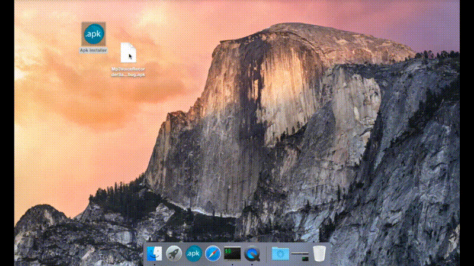

# APK Installer (Android)
This app allows you to make a typical double click on any `.apk` file. It will automatically run `adb install` command to the connected devices.

## Usage 1
Drag and drop any .apk file to the APK Installer icon in the Dock and get your app installed on **currently connected devices**.

* To do that, drag and drop APK Installer to your Dock first.

## Usage 2
Double Click on any .apk file and get your app installed on **currently connected devices**.

To do it properly you must:

* `⌘ + i` on any .apk file.
* Click on "Open with" dropdown.
* Select **Other..**
* Navigate to your Applications if not already there and choose the APK Installer app.
* Finally click on Change All... button in the same Info window.

## Installation

* Make sure to have Android SDK downloaded and PATH set up in `.bash_profile` (See how to do it [below](#Setting_up_.bash_profile)).
* Download the `APK Installer.app` and drag and drop it to your Applications.

## Setting up .bash_profile

* Open Terminal and write 
`touch ~/.bash_profile`
* Then 
`open -e ~/.bash_profile` which will open EditText. Do not close it yet.
* Open Finder.
* Navigate to the folder containing Android SDK.
* Drag and drop **platform-tools** folder from Finder window to Terminal window.
* Copy that path. Typically it looks like `/Users/<yourname>/Downloads/android-sdk/platform-tools`
* Go back to open EditText document and paste there the copied path prepending it with `export PATH=$PATH:`
* Save and close EditText document and Done!

Finally you should have something like this:
`export PATH=$PATH:/Users/<yourname>/Downloads/android-sdk/platform-tools`

## Credits

* This app was developed by @vitovalov

* Icon design by [ITMaryna](https://www.behance.net/ITMaryna)